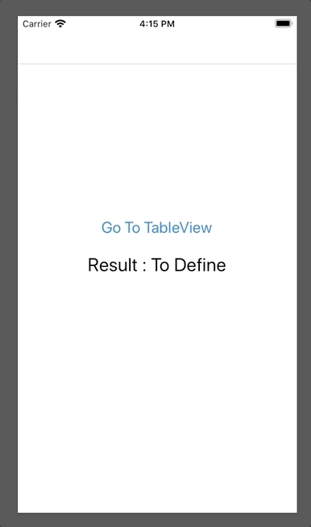

# ios-broken-code
Excerices to onboard
The objective of this exercise is to correct the crashes reported by XCode in first, then to redefine the communication between the viewControllers in order to have the same behavior as in the attached :
- First you have a ViewController with a label that displays the information retrieved and a button that launches a tableView
- In your tableView of 10 rows : 
  - click on 1 in 2 rows returns you to the previous page by transmitting the clicked row.
  - click on others 1 line 2 display a next page by transmitting the clicked line.
    - Clic on "Finish" return to the first ViewController by transmitting the clicked line
    
    .
